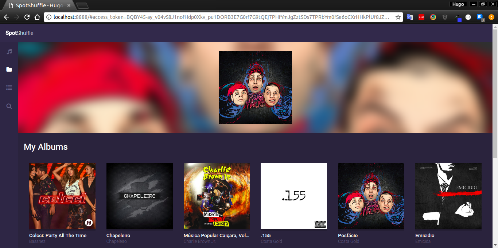

# SpotShuffle

---
Project developed with the purpose of studying the following technologies:
- ES6
- MVC architecture 
- Design patterns (Promises, Module)
- Babel and Webpack

You can see the the final result [here](https://nameless-dusk-44319.herokuapp.com).

---
In this application you can:
- Authenticate with Spotify
- List saved tracks, albums and playlists
- Search tracks
- View details for track and albums